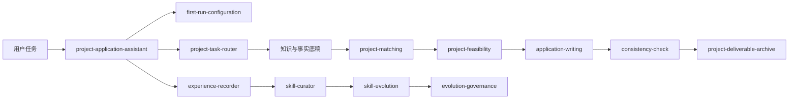
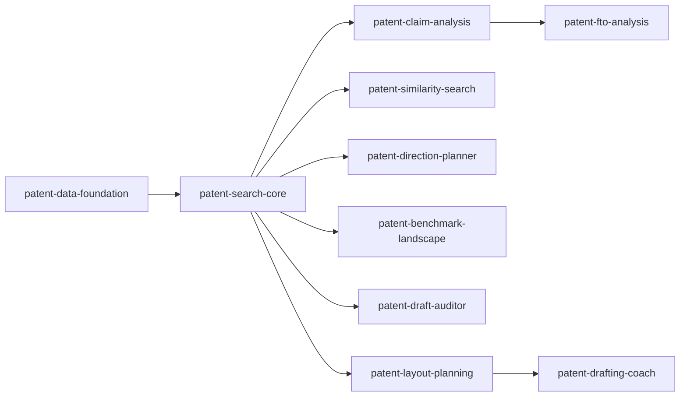

# 企业全生命周期助手 V1.1 技能调用关系核查

核查对象：56个正式团队Skills。

关系口径：硬依赖表示核心流程不可缺失；路由只选择技能；交接表示结构化结果传递；质量门禁负责强制复核；可选增强按任务触发；治理关系只在受控自进化流程中运行。

## 核查结论

- 56个技能均被调用图唯一覆盖，无遗漏、无重复分组。
- 所有关系目标均存在于正式技能包，未发现旧技能名或外部幽灵依赖。
- 硬依赖图无循环；总控路由与自进化反馈形成的是受控工作流，不是运行时递归。
- 用户默认只需触发 `project-application-assistant`；`project-task-router` 为内部路由，不与总入口竞争。
- 专利、项目申报、材料交付和受控自进化均形成清晰的单向主链，跨领域调用标记为可选增强。

## 核心流程图

## 专利主链

## 56个技能逐项关系

### 一、总控与配置层

| Skill | 主要职责 | 上游触发或输入 | 下游调用或交接 |
|---|---|---|---|
| `project-application-assistant` | 企业全生命周期总控技能。用于政府项目匹配、政策检索、企业分析、专利、财税法律、标准撰写、材料质量检查和归档，自动选择本技能包中的专业技能并组织执行顺序。 | — | `project-matching`〔交接〕 `experience-recorder`〔治理〕 `first-run-configuration`〔硬依赖〕 `local-knowledge-retrieval`〔硬依赖〕 `project-task-router`〔路由〕 |
| `project-task-router` | 识别政府项目申报、企业分析、知识产权、财税法律和标准撰写任务阶段并路由专业技能。适用于用户不知道具体能力名称、同时咨询多个任务或需要从检索到交付的组合流程。 | `project-application-assistant`〔路由〕 | — |
| `first-run-configuration` | 统一完成企业全生命周期助手首次配置、能力检测和自进化治理初始化。用户首次把技能包放入Agent、要求配置云端知识库、天眼查、企查查、专利数据、浏览器MCP、本地OCR、文档能力，或其他Skill发现外部能力未配置时自动使用；只提示一次并生成脱敏能力报告，避免每个Skill重复索要凭据。 | `project-application-assistant`〔硬依赖〕 | `evolution-governance`〔治理〕 `experience-recorder`〔治理〕 `skill-curator`〔治理〕 `skill-evolution`〔治理〕 |

### 二、知识与证据层

| Skill | 主要职责 | 上游触发或输入 | 下游调用或交接 |
|---|---|---|---|
| `local-knowledge-retrieval` | 检索团队统一云端知识服务。需要历史政策、相似案例、模板、企业名单、年份批次核验或既有项目经验时使用；自动执行简称与全称、年份与批次变体、结构化名单与全文双路径检索，并禁止一次未命中即判定资料不存在。 | `enterprise-panorama-analysis`〔硬依赖〕 `jiaotang-legal-regulations`〔硬依赖〕 `peer-benchmarking`〔硬依赖〕 `policy-retrieval`〔硬依赖〕 `project-application-assistant`〔硬依赖〕 | — |
| `policy-retrieval` | 检索并核验政府项目从管理办法、当期通知、指南附件、官方答疑、更正延期到公示结果的完整政策链；用户询问政策条件、申报时间、材料、最新通知或政策有效性时使用。 | `standard-drafting`〔可选增强〕 `high-tech-enterprise-preassessment`〔硬依赖〕 `project-feasibility`〔硬依赖〕 `project-matching`〔硬依赖〕 `regional-special-projects`〔硬依赖〕 | `web-task-operator`〔可选增强〕 `local-knowledge-retrieval`〔硬依赖〕 |
| `enterprise-profile` | 整理政府项目所需企业画像，包括工商、产品、研发、资质、荣誉、知识产权、风险和经营轨迹。进行项目匹配或可行性分析前使用。 | `peer-benchmarking`〔可选增强〕 `enterprise-panorama-analysis`〔硬依赖〕 `high-tech-enterprise-preassessment`〔硬依赖〕 `sme-score-preassessment`〔硬依赖〕 | — |
| `financial-verification` | 核验政府项目申报中的营收、利润、研发投入、资产、负债、增长率和专项财务指标。用户提供可靠财务资料后使用。 | `enterprise-panorama-analysis`〔可选增强〕 `high-tech-enterprise-preassessment`〔可选增强〕 `project-feasibility`〔可选增强〕 `sme-development-projects`〔可选增强〕 `sme-score-preassessment`〔可选增强〕 `manufacturing-tax-risk-analysis`〔硬依赖〕 | — |
| `ip-assessment` | 建立企业专利、商标和软著等知识产权事实底稿，核验权利状态、取得方式、主体变更、产品技术关联和政府项目证据价值；权利要求、FTO、侵权或授权前景分析转专利专业技能。 | `project-feasibility`〔可选增强〕 `sme-development-projects`〔可选增强〕 `intellectual-property-projects`〔硬依赖〕 | — |
| `evidence-ledger` | 建立事实、计算、推断和待核验四类证据台账，记录来源、原文位置、期间、冲突和结论引用关系，为项目匹配、可行性、写作和检查提供统一可追溯底稿。 | `graphify`〔可选增强〕 `application-writing`〔硬依赖〕 | — |
| `project-memory` | 管理政府项目客户任务的企业与项目身份、事实锁、政策版本、待办、决定、交付物和跨会话连续性；用户提到继续、上次或既有客户项目时使用，与个人偏好分离。 | — | `project-deliverable-archive`〔交接〕 |
| `project-rule-manager` | 在用户本地工作区管理不同省市区县的政府项目规则、年度版本、官方来源和核验状态。用于团队成员自行录入、更新、比较、撤回或读取项目门槛、评分、材料、截止日期、主管部门和来源文件；不向团队云端知识库写入成员修改。 | — | — |
| `third-party-data-indexing` | 实验性第三方数据索引技能。将企策顾问等用户有权访问的第三方政策、申报项目、申报条件及通过或公示企业名单增量写入本地SQLite索引，支持漏采补采、断点、限速、去重、版本记录、官方链接健康检查及Markdown或JSONL导出。仅在用户明确启用并要求更新政策库、采集企策顾问、建立项目索引、查询当日申报通知、公示名单或配置定时补采时使用。 | `project-matching`〔可选增强〕 | `web-task-operator`〔硬依赖〕 |
| `web-task-operator` | 使用宿主平台当前可用的浏览器、网页读取、计算机操作或用户授权登录会话，安全完成网页导航、搜索、筛选、翻页、表单填写、文件上传、结构化数据提取和结果核验。用户要求登录网站查询数据、操作后台、批量浏览页面、从动态网页采集资料或执行多步骤网页任务时使用。不得用于绕过访问控制、验证码、付费墙、网站封禁或未授权批量抓取。 | `policy-retrieval`〔可选增强〕 `third-party-data-indexing`〔硬依赖〕 | — |
| `peer-benchmarking` | 从政府公示名单和公开资料中建立同项目、同政策版本、同地区、同产品的可比企业事实对标，核验主体和年度口径；不由入选结果推定未公开评分或全部条件。 | — | `enterprise-profile`〔可选增强〕 `local-knowledge-retrieval`〔硬依赖〕 |
| `graphify` | 将代码、政策、项目资料或知识库目录构建为可查询的持久知识图谱。仅在用户明确要求知识图谱、关系图、路径追踪、社区聚类、GraphRAG或明确点名graphify时使用。 | — | `evidence-ledger`〔可选增强〕 |

### 三、企业与项目业务层

| Skill | 主要职责 | 上游触发或输入 | 下游调用或交接 |
|---|---|---|---|
| `project-matching` | 从政府项目库中匹配企业可申报方向。适用于用户询问能报哪些项目、需要多项目矩阵、申报优先级或年度路线图。 | `project-application-assistant`〔交接〕 | `project-feasibility`〔交接〕 `third-party-data-indexing`〔可选增强〕 `policy-retrieval`〔硬依赖〕 |
| `project-feasibility` | 对单个政府项目执行完整可行性分析，覆盖项目与版本确认、硬门槛、评分映射、证据状态、财务计算复核、不确定性、材料差距和结论生成。用户询问某企业能否申报、申报成功条件、差距、预评分或需要补什么材料时使用。 | `manufacturing-tax-risk-analysis`〔交接〕 `project-matching`〔交接〕 `regional-special-projects`〔交接〕 | `application-writing`〔交接〕 `financial-verification`〔可选增强〕 `industry-positioning`〔可选增强〕 `ip-assessment`〔可选增强〕 `policy-retrieval`〔硬依赖〕 |
| `industry-chain-foundation-matcher` | 严格依据用户提供的《产业链架构》和《产业基础创新发展目录（2021年版）》匹配主导产品的产业链层级与产业基础分类。用户询问适合什么产业链、工业六基怎么选、产业基础目录归属，或开展专精特新、小巨人体检及补短板、填空白论证时使用。 | `industry-positioning`〔硬依赖〕 `sme-development-projects`〔硬依赖〕 | — |
| `industry-positioning` | 在industry-chain-foundation-matcher给出目录候选后，判断企业主导产品的产业链关键环节和重点领域定位是否有收入、技术、客户、产线及知识产权证据；用于补短板、填空白和国产替代三档决策，不负责自行检索或创造目录分类。 | `project-feasibility`〔可选增强〕 | `industry-chain-foundation-matcher`〔硬依赖〕 |
| `enterprise-panorama-analysis` | 企业合作前公开信息全景调研与双版本 PDF 或网页式报告生成。用于企业尽调、工商股权、关联企业、战略经营、同行竞争、风控、知识产权、历史项目、可申报项目、五年规划和股权财税机会识别；生成前必须选择 A 标准销售版、B 深度顾问版或 C 两版，且两版共用同一事实底稿。A 标准销售版永久免水印。 | — | `financial-verification`〔可选增强〕 `manufacturing-tax-risk-analysis`〔可选增强〕 `patent-layout-planning`〔可选增强〕 `enterprise-profile`〔硬依赖〕 `local-knowledge-retrieval`〔硬依赖〕 |
| `manufacturing-tax-risk-analysis` | 基于制造企业近三年审计报告、财务报表及税务资料，完成三表复算、财务健康分析、金税四期与智慧税务风险筛查、订单和往来穿透、研发及所得税核验，并生成带金色居中水印的专业顾问版 PDF。用于用户提出制造企业金税四期分析、税务风险体检、审计报告财务分析、账票税款货一致性检查、税务整改方案或同类金色顾问报告时。 | `enterprise-panorama-analysis`〔可选增强〕 | `project-feasibility`〔交接〕 `financial-verification`〔硬依赖〕 |
| `jiaotang-legal-regulations` | 检索、核验并组织焦糖工作相关法律法规。用于政府项目申报、专精特新和小巨人、高新技术企业、财政奖补、科技成果转化、知识产权、研发财税、企业合规，以及客户所属行业专项法规分析；当用户询问适用法律、政策依据、合规红线、法规清单、现行效力或行业监管要求时使用。按中国国家、浙江省、杭州市和具体区县分层检索，并在客户或项目分析时动态补查行业专项法规与当期申报通知。 | `standard-drafting`〔可选增强〕 | `local-knowledge-retrieval`〔硬依赖〕 |
| `high-tech-enterprise-preassessment` | 高新技术企业认定申报前评估与申报年度选择。用于用户询问高企通过把握、今年报还是明年报、成长性零分能否申报、知识产权和成果转化如何评分、研发组织管理如何补强、首次认定或重新认定风险、需要比较连续两个申报年度，或需要生成高企预评估采集表时。执行硬门槛检查、目标分/保守分/压力分三档评分、知识产权使用与授权节点核验、成果转化滚动窗口分析、成长性精确计算和可执行补强计划；没有同地区校准样本时不得编造数字通过率。 | — | `financial-verification`〔可选增强〕 `enterprise-profile`〔硬依赖〕 `policy-retrieval`〔硬依赖〕 |
| `sme-score-preassessment` | 专精特新中小企业与专精特新“小巨人”申报前评分预评估。用户只要提出“给XX企业做专精特新申报前评分”“给我专精特新申报前评分表”“专精特新评分”“小巨人评分”“给这家企业评个分”“申报前测分”“看看差多少分”，或回传三年财务底表要求测分，即直接触发本技能，无需用户写技能名或说明操作流程。首次请求先生成近三年、近两年、近一年通用财务底表，说明填写方法并询问使用省级专精特新版还是小巨人版；客户回传底表并确认版本后，再自动完成企业核验、行业映射、统计局基准、八项财务代理、非财务逐项计分、三档总分和目标反推。不用于已经填写完成的申请书体检、跨章节一致性检查、财务勾稽审查或正式申报文本诊断；这些后期任务使用优质中小企业后期体检流程。 | — | `financial-verification`〔可选增强〕 `enterprise-profile`〔硬依赖〕 `sme-development-projects`〔硬依赖〕 |
| `sme-development-projects` | 分析创新型中小企业、专精特新中小企业、专精特新小巨人及相关培育项目。用户提及专精特新、小巨人、补短板、填空白、企业简介或主导产品产业链归属时使用。 | `sme-score-preassessment`〔硬依赖〕 | `financial-verification`〔可选增强〕 `ip-assessment`〔可选增强〕 `industry-chain-foundation-matcher`〔硬依赖〕 |
| `standard-drafting` | 按现行GB/T 1.1及适用的专项起草规则完成国家标准、行业标准、地方标准、团体标准和企业标准的立项分析、资料核验、结构设计、条款起草、编制说明、征求意见处理和一致性审查。用户提出写标准、编标准、标准立项、企业标准、团体标准、产品标准、服务标准、管理标准、试验方法标准、标准修订、标准审查或编制说明时使用。 | — | `jiaotang-legal-regulations`〔可选增强〕 `policy-retrieval`〔可选增强〕 |
| `agriculture-and-rural-projects` | 分析农业农村、乡村振兴、农业科技、农产品加工、未来农场、农业品牌和联农带农项目；用于核验农业主体、基地、生产、加工、质量安全和利益联结，纯食品制造或销售项目应转工业化或质量品牌技能。 | — | — |
| `digitalization-projects` | 分析数字化车间、智能工厂、未来工厂、工业互联网、5G工厂和制造数字化改造项目，核验设备联网、系统运行、数据集成、闭环绩效和安全；纯软件研发或普通办公软件采购不适用。 | — | — |
| `green-development-projects` | 分析绿色工厂、绿色供应链、节能节水、降碳、资源综合利用、清洁生产和环保改造项目，核验统计边界、基准期、单位指标、合规与实际成效。 | — | — |
| `industrialization-projects` | 分析首台套、首批次新材料、首版次软件、工业新产品及产业化示范项目。用户提及新装备、新材料、工业软件、样机、检测或示范应用时使用。 | — | — |
| `intellectual-property-projects` | 分析知识产权示范、管理体系、专利产业化、高价值专利组合、保护运用和商标品牌类政府项目，调用ip-assessment核验权利事实；FTO、侵权和无效分析转专利专业技能。 | — | `ip-assessment`〔硬依赖〕 |
| `investment-subsidy-projects` | 分析技术改造、设备更新、固定资产投资、产业化建设和专项资金项目，核验备案、建设期及合同发票付款资产证据链，复算适格投资；不代替审计结论。 | — | — |
| `quality-brand-projects` | 分析产品认定、制造精品、政府质量奖、标准品牌、市场地位、单项冠军和隐形冠军项目，先识别项目类型再核验对应质量、标准、认证、管理和市场证据。 | — | — |
| `regional-special-projects` | 将未纳入固定领域的市、区县、园区临时通知和新申报项目转换为带原文位置的候选规则，经核验后交project-feasibility；不为每个短期通知新建技能。 | — | `project-feasibility`〔交接〕 `policy-retrieval`〔硬依赖〕 |
| `talent-projects` | 分析个人、创新团队、创业人才、海外人才、博士后和人才载体项目，核验身份、劳动或创业关系、到岗时间、团队任务及隐私边界。 | — | — |
| `technology-innovation-projects` | 分析研发机构、企业研究院、科技计划、创新平台、科技奖励和成果类项目，核验研发条件、任务、预算、里程碑和验收指标；量产建设为主的任务转工业化或投资项目。 | — | — |
| `trade-and-open-economy-projects` | 分析货物贸易、服务贸易、跨境电商、境外展会、海外品牌和境外投资项目，核验订单、报关、物流、收汇、平台及币种期间；国内电商和国内展会不适用。 | — | — |

### 四、专利工程层

| Skill | 主要职责 | 上游触发或输入 | 下游调用或交接 |
|---|---|---|---|
| `patent-data-foundation` | 统一专利检索与分析使用的数据口径，负责专利号规范化、文本版本区分、三级法律状态来源、简单同族与扩展同族去重、申请人和当前权利人归一化、数据授权及可追溯记录。任何批量专利检索、相似专利、FTO、专利质检、预审分类匹配或行业专利布局任务均应先使用本技能建立数据底座。 | `patent-benchmark-landscape`〔硬依赖〕 `patent-claim-analysis`〔硬依赖〕 `patent-direction-planner`〔硬依赖〕 `patent-draft-auditor`〔硬依赖〕 `patent-fto-analysis`〔硬依赖〕 `patent-layout-planning`〔硬依赖〕 `patent-search-core`〔硬依赖〕 `patent-similarity-search`〔硬依赖〕 | — |
| `patent-search-core` | 为专利方向规划、相似专利检索、创造性稳定性分析、FTO和行业布局生成统一检索计划，覆盖技术特征拆解、关键词与同义词、IPC/CPC、申请人、日期边界、引证扩展和结果分层。需要查找相似专利、在先技术、竞争对手专利或开展稳定性分析时使用，并先调用 patent-data-foundation。 | `patent-benchmark-landscape`〔硬依赖〕 `patent-claim-analysis`〔硬依赖〕 `patent-direction-planner`〔硬依赖〕 `patent-draft-auditor`〔硬依赖〕 `patent-fto-analysis`〔硬依赖〕 `patent-layout-planning`〔硬依赖〕 `patent-similarity-search`〔硬依赖〕 | `patent-data-foundation`〔硬依赖〕 |
| `patent-claim-analysis` | 基于专利原文和可核验法律状态开展权利要求拆解、专利对比、技术特征映射、保护范围分析、稳定性初筛和专利组合价值分析。用户提到权利要求分析、专利比对、保护范围、稳定性、专利价值或技术要点提取时使用。FTO与产品上市侵权风险使用 patent-fto-analysis，不替代律师法律意见或正式无效、诉讼结论。 | `patent-fto-analysis`〔硬依赖〕 | `patent-data-foundation`〔硬依赖〕 `patent-search-core`〔硬依赖〕 |
| `patent-similarity-search` | 接收专利文件、专利名称、申请号、公开号、权利要求或技术方案，检索相似专利并按技术问题、必要技术特征、技术手段和技术效果解释相似度，同时列示申请人、当前权利人、关联公司、同族和法律状态。用户要求查相似专利、近似方案、竞争公司或专利查重时使用。 | — | `patent-data-foundation`〔硬依赖〕 `patent-search-core`〔硬依赖〕 |
| `patent-fto-analysis` | 针对明确产品版本、拟实施行为、目标国家或地区和基准日期，独立检索并分析当前有效及可能授权的专利权利要求，形成自由实施FTO风险初筛、要素对照、权利状态、到期时间和规避验证建议。用户提到FTO、自由实施、上市侵权风险、出口专利风险或产品落入专利范围时使用，不与创造性或授权性检索混用。 | — | `patent-claim-analysis`〔硬依赖〕 `patent-data-foundation`〔硬依赖〕 `patent-search-core`〔硬依赖〕 |
| `patent-drafting-coach` | 将真实技术资料整理为专利技术交底书、权利要求草案、说明书框架和审查意见答复分析清单，并检查术语一致性、支持关系、实施例完整性和保护层次。用户提到专利撰写、发明专利、实用新型、技术交底、权利要求书、说明书、附图、申请策略或审查意见答复时使用。不处理商标版权注册、诉讼代理或非正常专利申请。 | `patent-layout-planning`〔交接〕 | — |
| `patent-draft-auditor` | 对发明、实用新型或外观设计申请文件开展提交前全量风险检查，覆盖形式、保护客体、新颖性、创造性、实用性、充分公开、权利要求支持与清楚性、必要技术特征、单一性、修改超范围、同日双申、申请权、公开、保密审查、遗传资源、非正常申请及程序风险。用户要求检查完成的专利文案、专利法风险、26.3、创造性或形式问题时使用。 | — | `patent-data-foundation`〔硬依赖〕 `patent-search-core`〔硬依赖〕 |
| `patent-direction-planner` | 根据企业真实主营业务、产品、工艺、研发资料和现有专利，规划可实施的专利方向，并动态匹配企业所在地知识产权保护中心的备案条件、产业领域、IPC分类号及优先审查路径。用户询问某客户能写哪些专利、如何匹配本地预审优审或如何挖掘专利方向时使用。 | — | `patent-data-foundation`〔硬依赖〕 `patent-search-core`〔硬依赖〕 |
| `patent-benchmark-landscape` | 根据客户行业和地域选择国内或本地可比龙头，清洗集团关联申请人和专利族，分析其专利年度趋势、IPC/CPC、技术主题、核心权利要求、法律状态和技术演进，形成客户差距、布局方向并生成可追溯PPT。用户要求分析龙头专利布局、竞品技术路线、专利地图或生成专利布局PPT时使用。 | — | `patent-data-foundation`〔硬依赖〕 `patent-search-core`〔硬依赖〕 |
| `patent-layout-planning` | 根据企业产品路线、核心技术、现有专利、检索结果、竞争壁垒和政府项目节点规划未来专利组合，输出候选方向、证据准备、优先级和申请节奏；申请文件、预审方向和FTO分别转对应专利技能。 | `enterprise-panorama-analysis`〔可选增强〕 | `patent-drafting-coach`〔交接〕 `patent-data-foundation`〔硬依赖〕 `patent-search-core`〔硬依赖〕 |

### 五、写作与交付层

| Skill | 主要职责 | 上游触发或输入 | 下游调用或交接 |
|---|---|---|---|
| `application-writing` | 在项目版本、政策和企业事实核验完成后撰写政府项目正式材料，包括企业简介、主导产品、核心技术、补短板、填空白和产业链作用；不用于政策检索或资格判断。 | `project-feasibility`〔交接〕 | `evidence-ledger`〔硬依赖〕 `consistency-check`〔质量门禁〕 |
| `application-version-diff` | 对比政府项目申报材料的两个或多个版本，识别章节移动、新增删除、数字与来源、知识产权状态、政策依据和合规风险变化；单份材料质量检查使用consistency-check。 | — | `consistency-check`〔质量门禁〕 |
| `consistency-check` | 在政府项目材料提交前执行括号、数据、事实、四关联、路径、时间线和术语一致性闸门，定位跨章节冲突并给出保留、替换或补证后保留结论；不替代前期可行性分析。 | `application-version-diff`〔质量门禁〕 `application-writing`〔质量门禁〕 | `project-deliverable-archive`〔交接〕 |
| `project-deliverable-archive` | 自动整理政府项目、企业分析、知识产权分析和正式报告的已核验成果。用于复杂任务完成、生成正式交付物或用户要求归档时，在Agent可写工作区建立项目目录、版本和来源清单；不依赖特定笔记软件。 | `consistency-check`〔交接〕 `project-memory`〔交接〕 | — |

### 六、受控自进化层

| Skill | 主要职责 | 上游触发或输入 | 下游调用或交接 |
|---|---|---|---|
| `experience-recorder` | 在客户项目分析、正式申报材料、复杂分析、重要规则变更、基础设施迁移或用户纠正完成后自动使用。从任务中提取可复用经验、失败原因和质量规则，执行四问复盘并形成候选经验记录。 | `first-run-configuration`〔治理〕 `project-application-assistant`〔治理〕 | `skill-curator`〔治理〕 |
| `skill-curator` | 安装企业全生命周期助手后自动启用。根据任务使用记录、用户纠正和四问复盘检查技能重复、触发冲突、过期规则、使用情况和质量问题，提出合并、拆分、归档或保留建议。 | `experience-recorder`〔治理〕 `first-run-configuration`〔治理〕 `skill-authoring`〔治理〕 | `skill-evolution`〔治理〕 |
| `skill-evolution` | 安装企业全生命周期助手后自动启用。持续使用脱敏测试案例、执行轨迹、四问复盘和质量评分发现技能问题并生成候选优化；用户明确要求优化时也使用。不得未经审批直接修改或发布正式Skill。 | `first-run-configuration`〔治理〕 `skill-curator`〔治理〕 | `evolution-governance`〔治理〕 |
| `evolution-governance` | 安装企业全生命周期助手后自动启用，管理技能自主进化的审批、快照、测试、发布、审计和回滚。任何技能自动创建、修改、合并或归档前必须使用。 | `first-run-configuration`〔治理〕 `skill-authoring`〔治理〕 `skill-evolution`〔治理〕 | — |
| `skill-authoring` | 供管理员为本套件创建或修改专业技能候选，规划触发、互斥、工作流、资源、脚本、来源许可、测试和治理审批；不进入普通企业或政府项目任务，也不直接改写已签名核心。 | — | `evolution-governance`〔治理〕 `skill-curator`〔治理〕 |

## 逐条关系与原因

| 起点 | 关系 | 终点 | 业务原因 |
|---|---|---|---|
| `project-application-assistant` | 硬依赖 | `first-run-configuration` | 首次运行或能力报告缺失时，先统一检测知识库、企业数据、专利、浏览器、OCR和文档能力。 |
| `project-application-assistant` | 路由 | `project-task-router` | 复杂任务由内部路由器拆分阶段；单一明确任务直接进入专业技能。 |
| `project-application-assistant` | 硬依赖 | `local-knowledge-retrieval` | 政策、名单、案例和内部方法默认先查团队知识库。 |
| `project-application-assistant` | 交接 | `project-matching` | 企业与地区信息确认后进入候选项目匹配。 |
| `project-matching` | 交接 | `project-feasibility` | 候选项目不直接等于可申报结论，必须继续核验门槛、证据和差距。 |
| `project-feasibility` | 交接 | `application-writing` | 只有已确认项目版本且结论允许进入材料阶段时才写作。 |
| `application-writing` | 质量门禁 | `consistency-check` | 正式材料提交前检查数字、事实、产品、知识产权和章节联动。 |
| `consistency-check` | 交接 | `project-deliverable-archive` | 通过交付检查后归档终版、证据台账和必要附件。 |
| `application-version-diff` | 质量门禁 | `consistency-check` | 版本差异识别后，对拟采用终稿执行单份材料一致性检查。 |
| `application-writing` | 硬依赖 | `evidence-ledger` | 正式材料中的事实、计算、推断和待补证项必须可追溯。 |
| `project-feasibility` | 硬依赖 | `policy-retrieval` | 可行性必须基于现行管理办法、当期通知和适用地区。 |
| `project-feasibility` | 可选增强 | `financial-verification` | 涉及营收、利润、研发投入、资产或负债门槛时调用。 |
| `project-feasibility` | 可选增强 | `ip-assessment` | 项目存在知识产权门槛或产品关联要求时调用。 |
| `project-feasibility` | 可选增强 | `industry-positioning` | 项目要求产业链、工业六基、补短板或重点领域定位时调用。 |
| `project-matching` | 硬依赖 | `policy-retrieval` | 项目名称、别名、层级、地区和年度以政策证据为准。 |
| `project-matching` | 可选增强 | `third-party-data-indexing` | 第三方项目库只提供动态发现线索，不能替代官方核验。 |
| `policy-retrieval` | 硬依赖 | `local-knowledge-retrieval` | 先查团队已有原文和版本记录，未命中再联网核验。 |
| `policy-retrieval` | 可选增强 | `web-task-operator` | 政府网页需要动态筛选、翻页或附件下载时调用。 |
| `third-party-data-indexing` | 硬依赖 | `web-task-operator` | 合法登录后的列表、详情、附件和增量采集由网页任务技能执行。 |
| `peer-benchmarking` | 硬依赖 | `local-knowledge-retrieval` | 优先从公示、认定和复核名单中提取可追溯同行样本。 |
| `peer-benchmarking` | 可选增强 | `enterprise-profile` | 名单缺少城市、曾用名或主体状态时补做企业身份核验。 |
| `industry-positioning` | 硬依赖 | `industry-chain-foundation-matcher` | 产业定位必须复用包内产业链和工业六基目录匹配结果。 |
| `intellectual-property-projects` | 硬依赖 | `ip-assessment` | 知识产权类项目必须先统一有效授权、审中、失效和转让取得口径。 |
| `regional-special-projects` | 硬依赖 | `policy-retrieval` | 临时专项先取得完整官方政策链。 |
| `regional-special-projects` | 交接 | `project-feasibility` | 将已核验的临时规则交给通用可行性流程。 |
| `high-tech-enterprise-preassessment` | 硬依赖 | `policy-retrieval` | 先锁定高企现行政策、申报年度和地区口径。 |
| `high-tech-enterprise-preassessment` | 硬依赖 | `enterprise-profile` | 主体、成立时间、行业和知识产权归属必须先核验。 |
| `high-tech-enterprise-preassessment` | 可选增强 | `financial-verification` | 成长性、研发费用和高新收入测算复用可靠财务事实。 |
| `sme-score-preassessment` | 硬依赖 | `sme-development-projects` | 复用专精特新和小巨人的现行项目版本、指标口径和材料阶段边界。 |
| `sme-score-preassessment` | 硬依赖 | `enterprise-profile` | 评分前核验企业身份、资质、知识产权和基础经营事实。 |
| `sme-score-preassessment` | 可选增强 | `financial-verification` | 评分底表回传后校验三年财务口径与勾稽关系。 |
| `sme-development-projects` | 硬依赖 | `industry-chain-foundation-matcher` | 主导产品产业链和工业六基定位使用统一目录依据。 |
| `sme-development-projects` | 可选增强 | `financial-verification` | 申请书财务指标和市场占有率底稿需要可靠数据时调用。 |
| `sme-development-projects` | 可选增强 | `ip-assessment` | 核验知识产权法律状态及其对主导产品的直接支撑关系。 |
| `manufacturing-tax-risk-analysis` | 硬依赖 | `financial-verification` | 三表复算和税务风险信号统一写入可复用财务事实。 |
| `manufacturing-tax-risk-analysis` | 交接 | `project-feasibility` | 经校验的 enterprise-financial-facts/v1 可供后续项目门槛复用。 |
| `jiaotang-legal-regulations` | 硬依赖 | `local-knowledge-retrieval` | 法规、废止替代依据和内部合规方法优先从团队知识库检索。 |
| `standard-drafting` | 可选增强 | `policy-retrieval` | 核验现行起草规则、强制性标准、法规和专项依据。 |
| `standard-drafting` | 可选增强 | `jiaotang-legal-regulations` | 涉及合规边界、强制要求或专利声明时补充法规核验。 |
| `enterprise-panorama-analysis` | 硬依赖 | `enterprise-profile` | 全景报告先建立统一企业主体与工商事实底稿。 |
| `enterprise-panorama-analysis` | 硬依赖 | `local-knowledge-retrieval` | 内部资料、政策名单和历史项目记录优先走团队知识库。 |
| `enterprise-panorama-analysis` | 可选增强 | `financial-verification` | 用户提供可靠财务资料时才进入财务分析。 |
| `enterprise-panorama-analysis` | 可选增强 | `manufacturing-tax-risk-analysis` | 制造企业且用户明确要求金税或税务分析时调用。 |
| `enterprise-panorama-analysis` | 可选增强 | `patent-layout-planning` | 用户需要未来知识产权规划时进入专利布局链。 |
| `graphify` | 可选增强 | `evidence-ledger` | 复杂项目可将证据台账转为关系图，但图谱不替代原始证据。 |
| `project-memory` | 交接 | `project-deliverable-archive` | 项目状态与终版交付分别保存，避免把过程记忆当正式档案。 |
| `patent-search-core` | 硬依赖 | `patent-data-foundation` | 检索结果统一使用专利号、文本版本、法律状态、同族和申请人数据口径。 |
| `patent-claim-analysis` | 硬依赖 | `patent-data-foundation` | 权利要求分析必须锁定公开版、授权版和当前法律状态。 |
| `patent-claim-analysis` | 硬依赖 | `patent-search-core` | 需要通过检索计划定位对比文件和相关权利要求。 |
| `patent-similarity-search` | 硬依赖 | `patent-data-foundation` | 相似专利必须使用统一身份和文本版本。 |
| `patent-similarity-search` | 硬依赖 | `patent-search-core` | 关键词、分类号、申请人和引证扩展由检索核心生成。 |
| `patent-fto-analysis` | 硬依赖 | `patent-data-foundation` | FTO必须核验目标国家、权利状态和有效权利要求版本。 |
| `patent-fto-analysis` | 硬依赖 | `patent-search-core` | 产品特征检索和竞争专利发现使用统一检索计划。 |
| `patent-fto-analysis` | 硬依赖 | `patent-claim-analysis` | 风险判断基于逐项权利要求特征比对，不以摘要相似替代。 |
| `patent-draft-auditor` | 硬依赖 | `patent-data-foundation` | 申请文件审查需要统一现有技术和已知专利事实。 |
| `patent-draft-auditor` | 硬依赖 | `patent-search-core` | 提交前检查需要确认检索范围和已发现对比文件。 |
| `patent-direction-planner` | 硬依赖 | `patent-data-foundation` | 方向规划先核验企业现有专利、法律状态和产品关联。 |
| `patent-direction-planner` | 硬依赖 | `patent-search-core` | 通过检索识别空白、拥挤方向和竞争主体。 |
| `patent-benchmark-landscape` | 硬依赖 | `patent-data-foundation` | 标杆企业专利按同族、权利状态和申请人归一化。 |
| `patent-benchmark-landscape` | 硬依赖 | `patent-search-core` | 标杆检索采用统一关键词、分类号和申请人扩展。 |
| `patent-layout-planning` | 硬依赖 | `patent-data-foundation` | 布局前先建立现有专利资产和产品映射底稿。 |
| `patent-layout-planning` | 硬依赖 | `patent-search-core` | 布局缺口和方向优先级必须有检索证据。 |
| `patent-layout-planning` | 交接 | `patent-drafting-coach` | 确认后的布局方向进入交底书和申请文件辅导。 |
| `first-run-configuration` | 治理 | `experience-recorder` | 首次安装后启用脱敏经验和纠正信号记录。 |
| `first-run-configuration` | 治理 | `skill-curator` | 首次安装后启用重复、冲突、过期和质量问题策展。 |
| `first-run-configuration` | 治理 | `skill-evolution` | 首次安装后允许生成候选优化，但不自动发布。 |
| `first-run-configuration` | 治理 | `evolution-governance` | 首次安装后建立审批、快照、签名和回滚治理。 |
| `project-application-assistant` | 治理 | `experience-recorder` | 复杂任务完成后记录可泛化经验并执行四问复盘。 |
| `experience-recorder` | 治理 | `skill-curator` | 将已脱敏且已核验的纠正和复盘交给策展聚合。 |
| `skill-curator` | 治理 | `skill-evolution` | 达到跨任务阈值后生成批量候选，不因单次纠正立即进化。 |
| `skill-evolution` | 治理 | `evolution-governance` | 候选版本必须经过影响审查、测试、审批、签名和回滚门禁。 |
| `skill-authoring` | 治理 | `skill-curator` | 创建新技能前先检查是否应合并到现有技能。 |
| `skill-authoring` | 治理 | `evolution-governance` | 新技能属于正式能力变更，必须进入统一发布治理。 |
