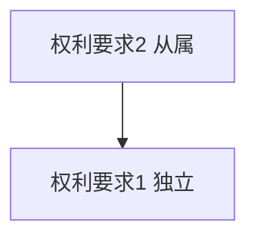

# 专利分析框架

## 法律状态来源等级

| 等级 | 来源 | 使用规则 |
|---|---|---|
| 一级 | 国家知识产权局专利登记簿副本、法律状态证明或等效官方登记文件 | 可作为当前法律状态的最高等级依据，记录出具日期 |
| 二级 | 国家知识产权局官方公报、官方公开文本和官方检索系统 | 可证明公开、授权和公告事件；状态可能存在更新滞后 |
| 三级 | Google Patents、Espacenet、商业数据库及其他第三方平台 | 只作检索线索和交叉验证，不单独表述为最终法律结论 |

每条状态记录标注来源等级、来源名称、查询日期和对应事件日期。来源冲突时以高等级来源为准；只有三级来源时使用“第三方数据显示”，并要求补充官方核验。

## 权利要求依附关系

先输出关系表：

| 权利要求 | 类型 | 直接引用 | 最终依附独立项 | 异常 |
|---|---|---|---|---|
| 1 | 独立 | 无 | 1 | 无 |

再输出Mermaid图：



至少检查：

1. 自我引用。
2. 引用不存在或后序编号。
3. 循环引用。
4. 多项从属权利要求的引用方式和择一关系。
5. 从属项是否实际增加限定特征。

发现异常时保留原文，不擅自替申请人修正；如存在授权B版，检查异常是否已在B版消除。

## A公开版与B授权版差异

发现授权事件后必须取得两个版本，并至少比较：

| 比较项 | A公开版 | B授权版 | 变化及影响 |
|---|---|---|---|
| 权利要求数量 |  |  |  |
| 独立权利要求 |  |  |  |
| 依附关系 |  |  |  |
| 新增必要特征 |  |  |  |
| 删除或合并权利要求 |  |  |  |
| 术语和范围变化 |  |  |  |

逐项标记未变、增加限定、删除限定、改写、合并、删除和新增。保护范围分析以B版为准；A版只用于理解申请历程和修改来源。缺少B版时不得继续现行保护范围、侵权、FTO或稳定性结论。

## 摘要特征遗漏检查

将摘要中的技术组成、控制关系、使用场景和技术效果拆成独立特征，与全部权利要求对照：

| 摘要特征 | 独立权利要求 | 从属权利要求 | 状态 | 影响 |
|---|---|---|---|---|
|  |  |  | 已进入独立项/仅进入从属项/未进入/无法确认 |  |

“未进入权利要求”表示该摘要内容不能仅因出现在摘要中就当然成为保护范围。进一步检查其是否只存在于说明书、是否属于技术效果，以及是否暴露潜在保护遗漏。

## 权利要求对照表

| 序号 | 必要技术特征 | 权利要求依据 | 目标方案证据 | 判断 | 说明 |
|---|---|---|---|---|---|
| 1 |  |  |  | 满足/不满足/不确定/缺证据 |  |

判断“可能落入”至少要求一项独立权利要求的全部必要技术特征均有证据支持。任一必要技术特征不满足时，不能按字面全部覆盖；等同原则分析应单独列出，并明确其司法辖区依赖和不确定性。

## 稳定性初筛

### 检索计划前置

在检索任何在先技术前先输出：

1. 优先权日或申请日及检索截止日期。
2. 独立权利要求的核心概念组和区别特征组。
3. 中文关键词、英文关键词、同义词、上位词和行业常用表达。
4. 至少三组布尔检索式：宽检索、组合检索和区别特征检索。
5. 原文已有IPC/CPC分类及待扩展的相邻分类。
6. 拟检索数据库、检索顺序和结果筛选标准。

检索式模板：

```text
宽检索：概念A AND 概念B
组合检索：(概念A OR 同义词A) AND (概念B OR 同义词B)
区别特征：(核心对象) AND (区别结构 OR 区别控制关系)
分类检索：CPC/IPC分类号 AND 关键区别特征
```

CPC/IPC计划不能只照抄公开文本分类号。先说明每个分类与权利要求特征的对应关系，再决定是否扩展上位组、下位组和相邻技术领域。

### 分析项目

分别检查：

1. 新颖性：是否存在单一在先文献公开全部必要技术特征。
2. 创造性：最接近现有技术、区别特征、实际技术问题和组合启示。
3. 支持与清楚：权利要求是否得到说明书支持，术语和边界是否明确。
4. 修改风险：授权或后续程序中的修改是否引入范围或依据问题。
5. 程序与状态：费用、期限、无效、复审、诉讼和权利终止信息。

只输出风险等级和依据，不输出未经正式程序确认的“有效”或“无效”结论。

## FTO初筛输出

- 检索范围和截止日期。
- 目标产品版本和销售地区。
- 重点有效专利及专利族。
- 独立权利要求特征对照。
- 高、中、低和无法判断的风险项。
- 需补充的产品证据、法律状态和审查历史。
- 建议由专业律师或代理师复核的争议点。

## 专利组合价值

至少从保护范围、法律稳定性、剩余期限、地域覆盖、产品关联、实施证据、替代难度和专利族质量八个维度评价。没有交易、许可、收入或成本数据时，不推算货币价值。
