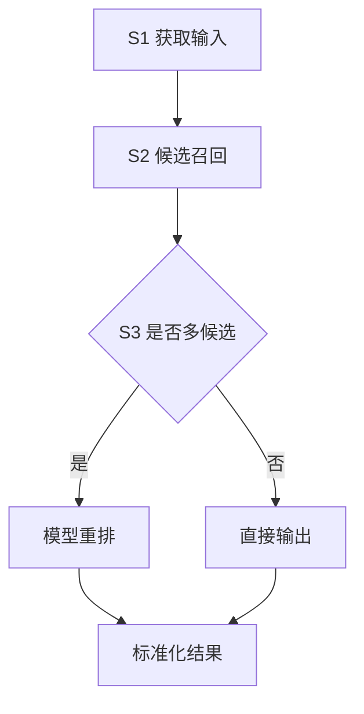

# 专利说明书式技术文本参考

本文档为 Step 7 的补充参考。目标是生成**技术内容充分、可供代理人继续撰写权利要求和说明书**的文本，而不是普通项目介绍。

## 推荐正文骨架

```markdown
# 一种XXX方法、系统、设备及介质

## 技术领域

## 背景技术

## 发明内容

### 要解决的技术问题

### 技术方案

#### 方法方案

#### 系统方案

#### 设备、介质或程序产品方案

### 有益效果

## 附图说明

## 具体实施方式

### 实施例一：整体方法流程

### 实施例二：关键子流程

### 实施例三：系统模块与数据交互

### 可选实施方式与异常分支

## 摘要
```

## 写作颗粒度

### 发明内容的颗粒度

发明内容不能只写“本发明包括若干模块”。应写成可转为权利要求的步骤：

```markdown
本发明提供一种XXX方法，包括：

S1，获取……；
S2，根据……进行……，得到……；
S3，若……，则……；否则……；
S4，将……输入……，得到……；
S5，根据……输出……。
```

每个步骤都要有：

- 输入对象。
- 处理方式。
- 输出结果。
- 与下一步骤的连接。
- 判断条件或回退分支。

### 具体实施方式的颗粒度

具体实施方式要比发明内容更细。每个关键步骤应展开为一段或多段：

- 使用什么数据结构或字段。
- 如何构造检索、匹配、排序、过滤或映射。
- 参数如何设置，阈值如何判断。
- 模型输入/输出是什么。
- 多候选、无候选、低置信、模型幻觉、规则失败时怎么处理。
- 结果如何标准化输出。

示例写法：

```markdown
S2-1，对输入文本进行分词，得到至少一个检索关键词；
S2-2，将原始文本和检索关键词分别输入多个检索字段；
S2-3，按照各检索字段对应的权重计算综合得分；
S2-4，按照综合得分排序，取前 N 个作为候选结果。
```

### 参数表示例

```markdown
| 参数 | 含义 | 示例值 | 说明 |
|------|------|--------|------|
| N | 候选结果数量 | 10 | 可根据业务规模调整 |
| \(\tau_1\) | 初筛阈值 | 0.6 | 低于该值的候选被过滤 |
| \(\tau_2\) | 直接确认阈值 | 0.85 | 高于该值可不进入重排 |
```

参数示例值只作为实施方式，不限制保护范围。

### 样本/模型训练写法

若方案涉及模型或样本，须写：

- 样本如何构造。
- 标签或得分如何标注。
- 训练目标是什么。
- 损失函数或优化指标是什么。
- 模型如何部署或调用。

不要公开真实训练数据、客户数据、完整 prompt 或完整规则表。

### 大模型写法

大模型相关内容应写“输入要素和输出约束”，不必公开完整提示词：

```markdown
根据用户问题、候选结果和预设判断依据生成大模型提示语句；
所述判断依据包括……；
通过语言大模型输出候选结果编号、标准化名称和判断理由；
校验所述输出是否属于候选结果集合，若不属于，则重新生成提示或转人工/用户确认。
```

## 附图要求

至少提供：

- 图1：整体方法流程图。
- 图2：系统模块结构图。

复杂技术建议增加：

- 图3：关键子流程图，例如多字段检索、规则增强、样本泛化、失败闭环。
- 图4：模型推理或数据结构示意图。

图示正文用 mermaid 表达，例如：



## 有益效果写法

有益效果必须与技术步骤对应：

- “通过 S2 的多字段加权检索，提升候选召回覆盖率。”
- “通过 S4 的候选集合约束，避免大模型输出候选外结果。”
- “通过字段级规则绑定，减少对无关字段的误改。”

避免：

- “本发明效果好。”
- “提高效率和准确率。”
- “具有广泛应用前景。”

## 摘要写法

摘要用 150-300 字，包含：

- 技术领域。
- 核心步骤。
- 主要效果。

示例结构：

```markdown
本发明公开了一种XXX方法、系统、设备及介质，涉及……技术领域。方法包括：……。本发明通过……，实现……，解决……问题。
```

## 不写入正文的内容

- 注意事项。
- 技术联系人。
- 委托确认话术。
- Skill/Agent/生成过程。
- 自检清单。
- 商业秘密的完整 prompt、规则表、真实客户口径、真实训练数据。

## 交付自检重点

交付前确认：

- 发明内容至少有 5 个实质性方法步骤，除非技术本身极简单。
- 具体实施方式覆盖每个核心步骤。
- 至少写了一个关键子流程实施例。
- 至少写了一个异常分支或回退策略。
- 至少写了一个系统模块方案。
- 若有模型/规则/检索/评分，已写参数或表格。
- 文中无注意事项、联系人、委托确认等非技术正文。
